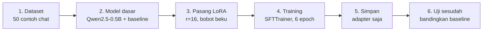
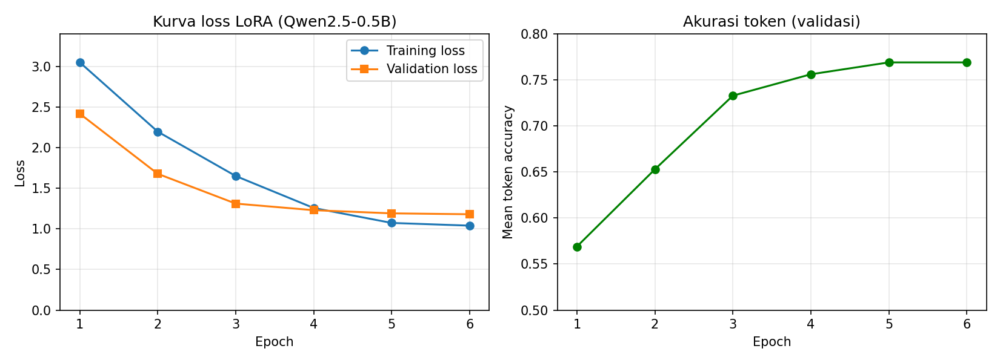

# Fine-Tuning LLM dengan LoRA: Asisten Customer Service "Sinar Elektronik"

https://colab.research.google.com/github/Aulyaaaaa/Aulyaaaaa/blob/main/code.ipynb

Tugas mata kuliah **LLM dan Agent AI**. Repo ini berisi hands-on lab *fine-tuning* model bahasa **Qwen2.5-0.5B-Instruct** dengan teknik **LoRA** (Low-Rank Adaptation) agar menjawab sebagai asisten customer service toko elektronik fiktif dengan persona yang konsisten: selalu diawali sapaan *"Terima kasih telah menghubungi Sinar Elektronik!"* dan ditutup *"Ada lagi yang bisa dibantu?"*.

> Catatan: ganti `USERNAME` pada tautan badge di atas dengan nama akun GitHub, agar tombol *Open in Colab* berfungsi.

## Apa yang dipelajari

1. Apa itu fine-tuning LLM, dan bedanya dengan prompt engineering dan RAG.
2. Cara kerja LoRA, dari konsep (simulasi numpy) sampai implementasi dengan `peft` dan `trl`.
3. Membandingkan perilaku model **sebelum** dan **sesudah** fine-tuning, termasuk uji generalisasi dan uji adapter ON/OFF.

## Alur hands-on



## Mekanisme LoRA singkat

Bobot asli `W` dibekukan. Perubahan bobot didekati oleh dua matriks kecil berpangkat rendah `A` dan `B`:

```
h = W·x + (α/r) · B·A·x
```

- `A` berukuran `r × d_in` (acak kecil), `B` berukuran `d_out × r` (diisi **nol** di awal).
- Karena `B = 0`, model awal identik dengan model dasar, lalu training hanya mengubah `A` dan `B`.
- Contoh `q_proj` Qwen (896 × 896): bobot penuh 802.816 parameter, adapter LoRA (r=16) hanya 28.672 parameter.

## Konfigurasi percobaan

| Komponen | Nilai |
|---|---|
| Model dasar | `Qwen/Qwen2.5-0.5B-Instruct` |
| Data | 50 contoh (5 kategori x 10), split 42 latih dan 8 evaluasi |
| LoRA | `r=16`, `lora_alpha=32`, `lora_dropout=0.05` |
| Modul target | `q_proj`, `k_proj`, `v_proj`, `o_proj` |
| Training | 6 epoch, batch 4, gradient accumulation 2 (batch efektif 8), learning rate 2e-4, 36 langkah |
| Trainer | `trl.SFTTrainer` |

## Hasil

Angka berikut berasal dari run notebook di Google Colab (GPU T4). Hasil run kamu bisa sedikit berbeda antar versi library.

| Metrik | Hasil |
|---|---|
| Parameter model dasar | 496.195.456 |
| Parameter yang dilatih | **2.162.688 (0,4359%)** |
| Waktu training | sekitar 33 detik (T4) |

| Epoch | Training loss | Validation loss | Mean token accuracy |
|---|---|---|---|
| 1 | 3,0501 | 2,4179 | 0,5690 |
| 2 | 2,1966 | 1,6778 | 0,6529 |
| 3 | 1,6505 | 1,3111 | 0,7329 |
| 4 | 1,2569 | 1,2298 | 0,7561 |
| 5 | 1,0730 | 1,1910 | 0,7690 |
| 6 | 1,0397 | 1,1800 | 0,7690 |



### Temuan utama

- **Gaya dan format dipelajari dengan baik.** Setelah fine-tuning, semua jawaban uji (termasuk pertanyaan di luar dataset) diawali sapaan dan ditutup kalimat khas toko. Model dasar tidak pernah melakukannya.
- **Isi jawaban tidak dijamin benar.** Model masih bisa mengarang (misalnya tautan palsu untuk retur, atau jawaban tidak nyambung untuk pertanyaan di luar topik). Dengan 50 contoh dan model 0,5 miliar parameter, fine-tuning meniru *bentuk* jawaban, bukan menanamkan *fakta*.
- **Kaitan dengan RAG.** Pendekatan yang lebih baik adalah menggabungkan keduanya: fine-tuning untuk persona dan gaya, RAG untuk mengambil fakta kebijakan dari dokumen.
- **Adapter bisa dinyalakan dan dimatikan** tanpa memuat ulang model (`disable_adapter()`), membuktikan seluruh perubahan perilaku tersimpan di adapter.
- **Jumlah parameter LoRA bisa dihitung dengan rumus** dan cocok persis dengan hasil `print_trainable_parameters()` (Qwen memakai Grouped-Query Attention, jadi `k_proj` dan `v_proj` berdimensi keluaran lebih kecil).

## Cara menjalankan (Google Colab)

1. Klik badge **Open in Colab** di atas, atau unggah `Tugas_Fine_Tuning_LLM_LoRA_Aulya.ipynb` ke [colab.research.google.com](https://colab.research.google.com).
2. Aktifkan GPU: `Runtime -> Change runtime type -> T4 GPU`.
3. Jalankan semua sel dari atas ke bawah (`Runtime -> Run all`). Jika Colab meminta *restart runtime* setelah instalasi, restart lalu lanjutkan.
4. Sel cek GPU di awal akan memberi peringatan jika GPU tidak terdeteksi. Training di CPU bisa memakan puluhan menit.

Menjalankan secara lokal: `pip install -r requirements.txt`, lalu buka notebook dengan Jupyter. Disarankan memakai GPU NVIDIA.

## Demo UI (Streamlit)

Setelah training selesai, adapter bisa dipakai lewat antarmuka chat sederhana (`app.py`). Training dilakukan di Colab (butuh GPU), sedangkan UI dijalankan di komputer sendiri (misalnya lewat VS Code).

**1. Unduh adapter dari Colab** (jalankan setelah Tahap 9, sebelum sesi Colab berakhir):

```python
!zip -r adapter_lora.zip ./qwen-sinar-elektronik-lora/final_adapter
from google.colab import files
files.download("adapter_lora.zip")
```

**2. Ekstrak di folder proyek** sehingga strukturnya menjadi:

```
llm-finetuning-lora/
├── app.py
└── qwen-sinar-elektronik-lora/
    └── final_adapter/
        ├── adapter_config.json
        └── adapter_model.safetensors
```

**3. Pasang library dan jalankan:**

```bash
python -m venv .venv
.venv\Scripts\activate          # Windows (macOS/Linux: source .venv/bin/activate)
pip install -r requirements.txt
streamlit run app.py
```

Browser akan terbuka di `http://localhost:8501`.

Catatan:
- Model dasar Qwen2.5-0.5B-Instruct (sekitar 1 GB) diunduh otomatis dari Hugging Face saat pertama kali dijalankan.
- Tanpa GPU, jawaban bisa memakan beberapa detik sampai puluhan detik per pertanyaan.
- Kotak centang **Pakai adapter LoRA** di sidebar mematikan adapter sementara, sehingga jawaban model dasar bisa dibandingkan langsung dengan hasil fine-tuning.
- Setiap pertanyaan dijawab berdiri sendiri (riwayat hanya ditampilkan di layar), sesuai cara model dilatih dan diuji.
- Folder adapter masuk `.gitignore`, jadi tidak ikut ter-push ke GitHub.


## Keterbatasan

- Dataset kecil, dibuat sendiri, dan polanya seragam, sehingga belum mewakili data nyata.
- Evaluasi masih kualitatif (membaca jawaban) dengan sedikit pertanyaan uji, tanpa metrik faktualitas.
- Hanya satu konfigurasi yang dicoba (`r=16`, 6 epoch).

## Pengembangan lanjutan

- Perbanyak dan variasikan dataset, termasuk contoh jawaban "saya tidak tahu".
- Bandingkan `r` = 4, 8, 16, 32 dan variasi `target_modules`.
- Coba QLoRA untuk model yang lebih besar.
- Gabungkan dengan RAG agar isi jawaban berasal dari dokumen kebijakan toko.

## Referensi

- Hu et al. (2021), *LoRA: Low-Rank Adaptation of Large Language Models*.
- [Dokumentasi PEFT](https://huggingface.co/docs/peft) dan [dokumentasi TRL](https://huggingface.co/docs/trl).
- Model [Qwen2.5-0.5B-Instruct](https://huggingface.co/Qwen/Qwen2.5-0.5B-Instruct) oleh tim Qwen (Alibaba Cloud).

## Penulis

Aulya, mahasiswa Sains Data Politeknik Elektronika Negeri Surabaya. Tugas mata kuliah LLM dan Agent AI.
